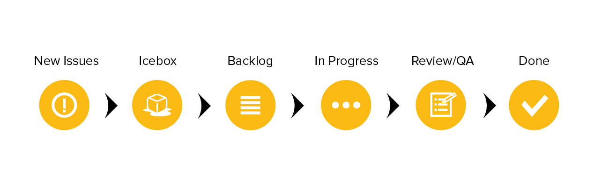

Backlog
==

The backlog for each project is managed through [Pivotal Tracker](https://www.pivotaltracker.com/).

## Story types

Any development must have a corresponding story before work has begun on the implementation. This story can take the form of a feature, bug or chore.

* **Features** are vertical slices of functionality that delivery business value in the form of software. They represent a complete set of usable functionality and are sized according to their relative difficulty using a point value based on the fibonacci sequence. Typically stories that are sized at 13 points or higher should be broken into smaller slices if possible so long as they deliver a complete set of functionality.

* **Bugs** are any technical issue that exists with currently deployed features. Bugs can also represent refactoring required on existing code. Bugs cannot be created for features that are in progress as these should be included in the feature work itself. Bugs are not sized.

* **Chores** represent small updates to existing code that may otherwise be categorized as a feature but are too minor in nature. These can be textual updates, typos, or documentation.

Stories are categorized by Type and further grouped into Epics using [Labels](./LABELS.md) representing areas of the application or large feature-sets. [Milestones](https://help.github.com/articles/creating-and-editing-milestones-for-issues-and-pull-requests/) are used to track progress against sprints, releases and important dates to the business stakeholders.

#### Features

Before work on a feature can begin, it must be thoroughly defined with at least the following:

* **Feature title** A feature title should include the common persona, requested feature, and a "so that" which describes the value this feature delivers to either the persona or the business: _"As a (user/admin/dev), I want (a goal), so that (benefit)."_

* **Context** Context is one of the most important parts of the feature and should be sufficiently detailed so that anyone reviewing the story knows the "Why". This is not another format for specifications or requirements. Rather, it should help to explain both the motivation for creating the issue and what is a valuable _outcome_ for the user.

* **Implementation** Implementation contains any relavent data necessary or useful when building this feature. This section needs to make more sense to the developer than the business stakeholder. This isn't necessarily a task list as one of these is provided by Pivotal.

* **How to Demo** This section should contain step-by-step instructions on how to demo the feature to the business stakeholder. It is important to keep this section free of any technical descriptors or complexities. It should be as simple as "do this, expect that". The How to Demo also provides a great starting point for an End to End test to accompany the feature.

* **Questions** This is where developers can capture questions they need to ask others later. These can be technical questions to ask other devs or business logic questions to ask the product owners. Answered questions can be put alongside the question in the story description or can be further discussed in the activity section at the bottom of the story.

* **Tasks** The tasks sections serves as a checklist to the developer and should represent the steps necessary to implement the story. Tasks should be broken up sufficiently so that no one task takes longer than one day. Tasks can and should be more technical in nature and serve as a leading indicator to the progress made on the feature.

#### Bugs and Chores

Bugs and chores must have full definition before the story can be started, but do not require the same ceremony as a feature. Generally, they should have the following:

* **Context** Optional for bug stories. This is a space to provide greater clarification than a story title allows.

* **Implementation** For bugs this should include details on the user, operating system, and any other environment information that is specific to the bug being experienced. Bugs need to include both expected and actual results from a user perspective. Chores should clearly capture the requested change with as much detail as necessary for the developer to have a clear definition of done.

* **Steps to Reproduce** Specific to bugs, this represents the "How to Demo" for the fix. These steps when followed should result in the original bug being observed for diagnosis and testing during development. During demo following these steps should result in the expected behavior as outlined in the requirements.

## Workflow

All issues are moved between Pipelines representing their current stage within the development lifecycle. Currently, the following workflow is observed:

* **Icebox** The Icebox generally represents items that are low priority in the backlog. Stories in this category should be populated with enough information on the story so that its purpose and business value are clear. Remember, some Icebox stories may stay in this category for a length of time before being prioritized.

* **Backlog** Stories in this pipeline are prioritized and ready for development. The developer should make an effort to fully populate all aspects of a story before clicking "Start."

* **Current Iteration** When a developer starts work on a story, it moves to the Current Iteration column. Each Story in this section should have an assigned owner who is responsible for its completion. If a team member decides to take on a task, they simply self-assign the Story and click start, instantly communicating to the rest of the team that the task is underway. Effort should be made to limit In Progress stories to one per team member, though exceptions can be made for blocked stories.

  * There are several states a "started" story may be in:
    * *Started* This story is being actively worked on.
    * *Finished* Functionality is complete for this feature or issues are resolved for this bug. Completed code is pushed to the accompanying feature/bug branch.
    * *Delivered* Code has been QA'd by other devs and is ready to be pushed live to develop branch and deployed to demo environment.
    * *Accepted* Completed functionality/bug fix has been demonstrated to developers and product owners and code is ready to be merged into master branch
    * *Rejected* Functioality demonstration did not behave as planned or completion criteria was not fulfilled in the eyes of the product owner. Revise and re-start story.

      *Chores only have a *Started* and *Finished* state and are immediately moved to the done column when "Finish" button is clicked?

* **Done** These issues have been accepted by the product owner or business stakeholder and no additional work is required. All code should meet the agreed-upon Definition of Done criteria and is awaiting final merge into the release branch.
